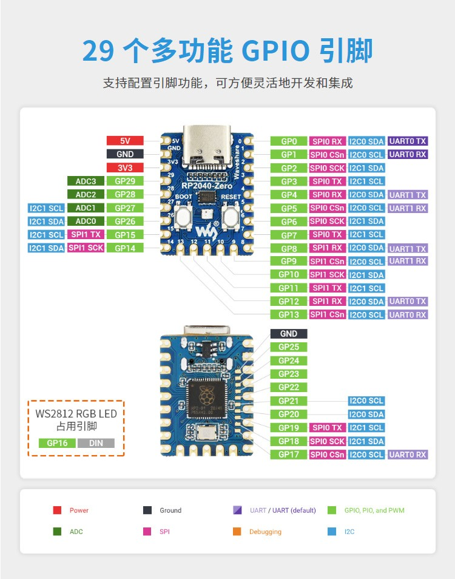
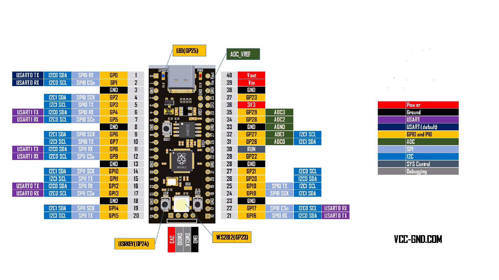

# MicroPython 脚本
## RP-2024 -Zero

## YD-RP2040

## XFW-ESP8266 [NodeMcu Esp8266]

# 元器件

DX-CT511N-A: UART  5V

AHT20:   I2C      3.3V - 5v  `0x38(56)`

SSD1306: I2C     3.3v - 5V   `0x3C(60)`   `0x3D (61)`

