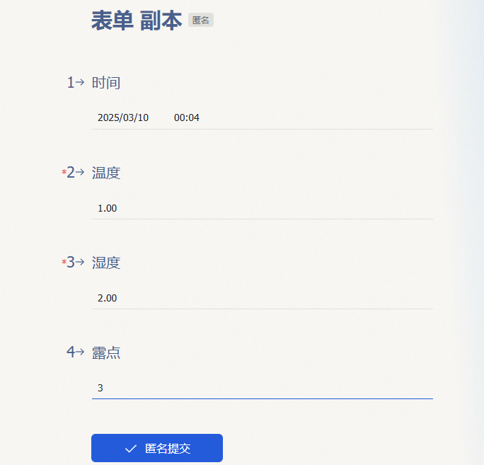

# jiESP8266温湿度计

收集环境温湿度信息实时显示并每分钟上传1min平均温湿度到飞书多维表格。


## 一、用到的模块

### 1. ESP82660.96 OLED模块

**产品介绍:**
模块主体ESP8266WIFI模组,外围使用USB转串口芯片CH340C扩展出TYPE-CUSB接口,可直接用USB连接电脑进行调试,数据伟专输快而稳定。模组拥有完整的WIFI络功能,支持标准的IEEE802.11b/g/n/e/i协议以及完整的TCP/IP协议栈。

本模块带有一块0.96寸OLED显示屏幕。它功耗低,性能高,适合初学者和专业人士开发脸用物联网项目。


| 参数                  | 说明                 |
| --------------------- | -------------------- |
| 工作电压              | 3.3V                 |
| 输入电压              | 7-12V                |
| 驱动器                | CH340C               |
| 数字I/O引脚(DIO)      | 16                   |
| 模拟输入引脚(ADC)     | 1                    |
| 闪存                  | 4MB                  |
| SRAM                  | 64 KB                |
| 时钟速度              | 80 MHz               |
| 模块尺寸              | 60mm * 31mm          |
| **0.96英寸OLED参数:**                       |
| 屏幕材料              | 玻璃, 需要良好的保护 |
| 尺寸                  | 0.96英寸             |
| 显示颜色              | 黄蓝                 |
| 电压                  | DC3.3V-5V            |
| 视角                  | >160°                |
| 高分辨率              | 128x64               |
| 工作温度              | -30°C~70°C           |

### 2. AHT20 温湿度模块


## 二、设备接线


## 三、安装MicroPython固件到Esp8266模块

1. 在MicroPython官网下载ESP8266通用固件（或下载源码自己编译固件）：[MicroPython - Python for microcontrollers[ESP8266]](https://micropython.org/download/ESP8266_GENERIC/)

2. 在电脑的Python环境中安装esptool， 用于为模块烧写MicroPython固件：`pip install esptool`

3. 使用ESPTool烧写固件：

   1. 将设备通过数据线连接到电脑；

   2. 通过设备管理器查询连接的端口：

      

   3. 擦除Flash： `esptool  -p 连接端口 -b 115200 --chip esp8266 erase_flash`

   4. 烧写固件：`esptool  -p 连接端口 -b 460800 --chip esp8266 write_flash --flash_size=detect 0 "固件路径" --verify`


## 四、安装Thonny编辑器，编辑调试代码

> [官网](https://thonny.org/)

下载并安装Thoony

1. 按下图配置编辑器，以连接到ESP8266模块；


2. 点击Stop自动连接到模块，连接成功，如下图：

   


## 五、编写代码

### 1. 连接到WiFi

通过固件提供的`network`模块可以轻松的连接到WiFi。

```python
import network

wlan = network.WLAN(network.STA_IF)  # 使用Client模式，创建一个wlan对象
wlan.active(True)					 # 激活设备
wlan.connect(ssid, password)		# 连接到 ssid	

while not wlan.isconnected():		# 判断是否已连接
    pass

wlan.ifconfig()						# 输出设备的IP地址，Mask，网关，DNS Server
```


### 2. 驱动屏幕（SSD1306）模块

开发板集成的屏幕使用I2C接口，SSD1306驱动。


驱动程序如下

```python
# MicroPython SSD1306 OLED driver, I2Cinterfaces
# file: ssd1306.py

from micropython import const
import framebuf


# register definitions
SET_CONTRAST = const(0x81)
SET_ENTIRE_ON = const(0xA4)
SET_NORM_INV = const(0xA6)
SET_DISP = const(0xAE)
SET_MEM_ADDR = const(0x20)
SET_COL_ADDR = const(0x21)
SET_PAGE_ADDR = const(0x22)
SET_DISP_START_LINE = const(0x40)
SET_SEG_REMAP = const(0xA0)
SET_MUX_RATIO = const(0xA8)
SET_COM_OUT_DIR = const(0xC0)
SET_DISP_OFFSET = const(0xD3)
SET_COM_PIN_CFG = const(0xDA)
SET_DISP_CLK_DIV = const(0xD5)
SET_PRECHARGE = const(0xD9)
SET_VCOM_DESEL = const(0xDB)
SET_CHARGE_PUMP = const(0x8D)

# Subclassing FrameBuffer provides support for graphics primitives
# http://docs.micropython.org/en/latest/pyboard/library/framebuf.html
class SSD1306(framebuf.FrameBuffer):
    def __init__(self, width, height, external_vcc):
        self.width = width
        self.height = height
        self.external_vcc = external_vcc
        self.pages = self.height // 8
        self.buffer = bytearray(self.pages * self.width)
        super().__init__(self.buffer, self.width, self.height, framebuf.MONO_VLSB)
        self.init_display()
    
    
    def write_cmd(self, cmd):
        raise NotImplemented

    def write_data(self, buf):
        raise NotImplemented

    def init_display(self):
        for cmd in (
            SET_DISP | 0x00,  # off
            # address setting
            SET_MEM_ADDR,
            0x00,  # horizontal
            # resolution and layout
            SET_DISP_START_LINE | 0x00,
            SET_SEG_REMAP | 0x01,  # column addr 127 mapped to SEG0
            SET_MUX_RATIO,
            self.height - 1,
            SET_COM_OUT_DIR | 0x08,  # scan from COM[N] to COM0
            SET_DISP_OFFSET,
            0x00,
            SET_COM_PIN_CFG,
            0x02 if self.width > 2 * self.height else 0x12,
            # timing and driving scheme
            SET_DISP_CLK_DIV,
            0x80,
            SET_PRECHARGE,
            0x22 if self.external_vcc else 0xF1,
            SET_VCOM_DESEL,
            0x30,  # 0.83*Vcc
            # display
            SET_CONTRAST,
            0xFF,  # maximum
            SET_ENTIRE_ON,  # output follows RAM contents
            SET_NORM_INV,  # not inverted
            # charge pump
            SET_CHARGE_PUMP,
            0x10 if self.external_vcc else 0x14,
            SET_DISP | 0x01,
        ):  # on
            self.write_cmd(cmd)
        self.fill(0)
        self.show()

    def poweroff(self):
        self.write_cmd(SET_DISP | 0x00)

    def poweron(self):
        self.write_cmd(SET_DISP | 0x01)

    def contrast(self, contrast):
        self.write_cmd(SET_CONTRAST)
        self.write_cmd(contrast)

    def invert(self, invert):
        self.write_cmd(SET_NORM_INV | (invert & 1))

    def show(self):
        x0 = 0
        x1 = self.width - 1
        if self.width == 64:
            # displays with width of 64 pixels are shifted by 32
            x0 += 32
            x1 += 32
        self.write_cmd(SET_COL_ADDR)
        self.write_cmd(x0)
        self.write_cmd(x1)
        self.write_cmd(SET_PAGE_ADDR)
        self.write_cmd(0)
        self.write_cmd(self.pages - 1)
        self.write_data(self.buffer)


class SSD1306_I2C(SSD1306):
    def __init__(self, width, height, i2c, addr=0x3C, external_vcc=False):
        self.i2c = i2c
        self.addr = addr
        self.temp = bytearray(2)
        self.write_list = [b"\x40", None]  # Co=0, D/C#=1
        super().__init__(width, height, external_vcc)

    def write_cmd(self, cmd):
        self.temp[0] = 0x80  # Co=1, D/C#=0
        self.temp[1] = cmd
        self.i2c.writeto(self.addr, self.temp)

    def write_data(self, buf):
        self.write_list[1] = buf
        self.i2c.writevto(self.addr, self.write_list)


```

例程：

> 该模块常用2个地址，切经常漂移

```python
# file: main_ssd1306.py

from machine import Pin,I2C
from ssd1306 import SSD1306_I2C

i2c = I2C(scl=Pin(5), sda=Pin(4))
drives = i2c.scan()
dprint("Address List:",i2c.scan())
# 该模块常用2个地址，切经常漂移，做了一个判断
oled = SSD1306_I2C(128,64,i2c, addr=60 if 60 in drives else 61)
oled.fill(0)
oled.text('Esp8266 Temp', 0, 0) # 在顶部输出文字
oled.hline(0,12, 128, 1)        # 在高度12出创建一条横线
oled.show()                     # 将上面的内容输出到屏幕

```


### 3. 驱动AHT20温度模块

AHT20温湿度模块使用I2C接口，和屏幕模块共用一个总线。


驱动程序：

```python
# file: aht20.py

import time
from math import log

# AHT10 Library for MicroPython on ESP32
# Author: Sean Yong
# Date: 23rd December, 2019
# Version 1.0

#CONSTANTS
AHT10_ADDRESS = 0x38 # 0111000 (7bit address)
AHT10_READ_DELAY_MS = 75 # Time it takes for AHT to collect data
AHT_TEMPERATURE_CONST = 200
AHT_TEMPERATURE_OFFSET = 50
KILOBYTE_CONST = 1048576
CMD_INITIALIZE = bytearray([0xE1, 0x08, 0x00])
CMD_MEASURE = bytearray([0xAC, 0x33, 0x00])
FARENHEIT_MULTIPLIER = 9/5
FARENHEIT_OFFSET = 32

class AHT20:
    def __init__(self, i2c, mode=0, address=AHT10_ADDRESS):
        if i2c is None:
            raise ValueError('I2C object required.')
        if mode is not (0 and 1):
            raise ValueError('Mode must be either 0 for Celsius or 1 Farenheit')
        self.i2c = i2c
        self.address = address
        self.i2c.writeto(address, CMD_INITIALIZE)
        self.readings_raw = bytearray(8)
        self.results_parsed = [0, 0]
        self.mode = mode # 0 for Celsius, 1 for Farenheit

    def read_raw(self):
        self.i2c.writeto(self.address, CMD_MEASURE)
        time.sleep_ms(AHT10_READ_DELAY_MS)
        self.readings_raw = self.i2c.readfrom(AHT10_ADDRESS, 6)
        self.results_parsed[0] = self.readings_raw[1] << 12 | self.readings_raw[2] << 4 | self.readings_raw[3] >> 4
        self.results_parsed[1] = (self.readings_raw[3] & 0x0F) << 16 | self.readings_raw[4] << 8 | self.readings_raw[5]

    def humidity(self):
        self.read_raw()
        return (self.results_parsed[0] / KILOBYTE_CONST) * 100 

    def temperature(self):
        self.read_raw()
        if self.mode is 0:
            return (self.results_parsed[1] / KILOBYTE_CONST) * AHT_TEMPERATURE_CONST - AHT_TEMPERATURE_OFFSET
        else:
            return ((self.results_parsed[1] / KILOBYTE_CONST) * AHT_TEMPERATURE_CONST - AHT_TEMPERATURE_OFFSET) * FARENHEIT_MULTIPLIER + FARENHEIT_OFFSET

    def set_mode(self, mode):
        if mode not in  (0, 1):
            raise ValueError('Mode must be either 0 for Celsius or 1 Farenheit')
        self.mode = mode

    def print(self):
        print("Temperature: " + str(self.temperature()) + ("C","F")[self.mode] + ", Humidity: " + str(self.humidity()))

    def dew_point(self):
        h = self.humidity()
        t = self.temperature()
        h = (log(h, 10) - 2) / 0.4343 + (17.62 * t) / (243.12 + t)  # type: ignore log有2个参数，默认以e为底
        return 243.12 * h / (17.62 - h)

```


例程：

```python
# file: main_aht20.py

from machine import Pin,I2C
from aht20 import AHT20

i2c = I2C(scl=Pin(5), sda=Pin(4))
drives = i2c.scan()
print("Address List:",i2c.scan())
aht20 = AHT20(i2c, mode=0, address=0x38)
aht20.print()
```


### 4. 将温度输出到屏幕上


```python
from machine import Pin, I2C
from ssd1306 import SSD1306_I2C
from aht20 import AHT20

i2c = I2C(scl=Pin(5), sda=Pin(4))
drives = i2c.scan()
dprint("Address List:",i2c.scan())
aht10 = AHT10(i2c, mode=0, address=0x38)
# 该模块常用2个地址，切经常漂移，做了一个判断
oled = SSD1306_I2C(128,64,i2c, addr=60 if 60 in drives else 61)
aht20 = AHT20(i2c, mode=0, address=0x38)

humi = aht20.humidity()
temp = aht20.temperature()
dewp = aht20.dew_point()
oled.fill(0)
oled.rect(0,16,128-32,46, 0, True)
oled.text("Temp: {:.2f}C".format(temp), 2, 16)
oled.text("Humi: {:.2f}%".format(humi), 2, 26)
oled.text("Dewp: {:.2f}C".format(dewp), 2, 36)
```


### 5. 将温度上传至飞书多维表格

1. 创建多维表格，表格中，至少需要`时间`，`温度`，`湿度`，`露点`
2. 为多维表格添加表单：
3. 保存发布，记录分享连接

4. 新建浏览器窗口，在调试模式（F12）下打开地址，并填写提交一组数据：
5. 找到如下请求，并拿到请求体：

6. 